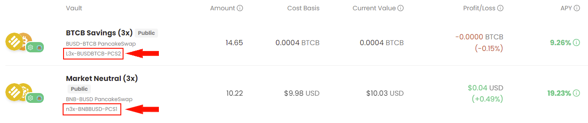

<!-- PROJECT HEADER -->
<div align="center">
  <a href ="https://www.alpacafinance.org//"></a>
  <br></br>
  <h2 align="center"><strong>Alpaca-Finance-Python</strong></h2>
  &nbsp&nbsp</img>
    <p align="center">
        An unofficial Python3.9+ package that models Binance Smart Chain positions on the Alpaca Finance platform to simplify interaction with their smart contracts in your Python projects.
    </p>
    <h3><strong>Supported Position Types</strong></h3>
    <i>Automated Vaults</i><br>
</div>
<br>

> NOTE: Existing users please update to the latest version of the package before using, core functionality has changed in version 1+.

<!-- TABLE OF CONTENTS -->
### Table of Contents
<details>
  <ol>
    <li><a href="#installation">Installation</a></li>
    <li><a href="#usage">Usage</a></li>
    <li><a href="#uninstallation">Uninstallation</a></li>
    <!-- <li><a href="#roadmap">Roadmap</a></li> -->
  </ol>
</details>

___

## Installation

This package is set up to be installed using the `pip` package manager.

1. Install the package using pip (you must use the git+url as this project is private and not listed on PyPi):
    ```bash
    pip install --upgrade git+https://github.com/PathX-Projects/Alpaca-Finance-Python.git
    ```
    <!-- ***Note:*** You may need to provide your git credentials depending on the repository privacy settings. In the event, if you need help generating a personal access token see [here](https://catalyst.zoho.com/help/tutorials/githubbot/generate-access-token.html) -->

2. After install, the package will be available to you in your local Python environment as ***alpaca_finance***

When updates are made to the package, the version will automatically be incremented so that in order to get the newest version on your end, you can simply use the same installation command and your pip will detect and update to the newest version.

___

## Usage

How to use the package

### Automated Vaults:

1. Import the package into your Python script:
    ```python
    from alpaca_finance.automated_vault import AutomatedVaultPosition
    ```

2. ***(Optional)*** Create your Web3 provider object to interact with the network (By default, the BSC RPC URL is used):
    ```python
    from alpaca_finance.util import get_web3_provider

    provider = get_web3_provider("your_rpc_url")
    ```

3. Creating an [AutomatedVaultPosition](alpaca_finance/automated_vault/positions.py) instance requires the following:
    - Your position key (string)
        - This key should match your position key on Alpaca Finance's webapp
        - 
  
    - Your public wallet key (string)

    - ***(Optional)*** Your private wallet key (string)
        - Your private key is required to sign transactions, but can be left as None if you are only going to be using the informational methods.

    Once you've gathered all of these variables, you can create the position instance like this example below:
    ```python
    position = AutomatedVaultPosition(position_key="n3x-BNBBUSD-PCS1", owner_wallet_address="0x...", owner_private_key="123abc456efg789hij...")
    ```
4. Use your position instance to interact with Alpaca Finance:
    - For reference, see the BEP20Token class [documentation](https://github.com/hschickdevs/Python-BEP20-Token/blob/main/bep20/token.py)
    - Please view the **usage examples** under [examples/automated_vault](examples/automated_vault)
    ```python    
    """ Informational Methods (Private Key not Required) """

    # Get the asset token or stable token for the vault (BEP20Token object)
    position.asset_token, position.stable_token


    # Get the current yields for the vault:
    position.yields()


    # Get the current vault TVL:
    position.tvl()


    # Get the current vault capacity:
    position.capacity()


    # Get the position's cost basis (entry price in USD):
    position.cost_basis()


    # Get the current position value (in USD):
    position.current_value()


    # Get the position profit/loss (PnL in USD):
    position.pnl()


    # Get the amount of shares held and the USD value of all shares held:
    position.shares()


    # get the full vault summary (See the documentation alpaca_fiance/position.py for more details):
    position.get_vault_summary()


    """ Transactional Methods (Private Key Required) """


    # Approve a token for deposit to the vault (only required once if never approved):
    position.do_approve_deposit_token(<token_address> or <BEP20Token object>)


    # Invest the given amount of stable and asset token into the vault:
    position.do_invest(<stable_token_amt>, <asset_token_amt>)


    # Withdraw the given amount of shares from the vault:
    # Available strategies: "Minimize Trading" and "Convert All" (as shown on the webapp)

    # Using the "Minimize Trading" strategy (default, so not necessary to specify strategy):
    position.do_withdraw(<shares_amt>)
    # Using the "Convert All" strategy (must specify, and provide the percentage of stable token to receive):
    position.do_withdraw(<shares_amt>, <pct_stable_token>, strategy="Convert All")  


    # Close a position (remove all shares):

    # (default) Using the "Minimize Trading" strategy:
    position.do_close()
    # Optionally specify the "Convert All" strategy:
    position.do_close(<pct_stable_token>, strategy="Convert All")
    ```

___

## Uninstallation:

Uninstall the package like any other Python package using the pip uninstall command:
```bash
pip uninstall alpaca-finance
```

## Contributions:

*Coming soon...*
